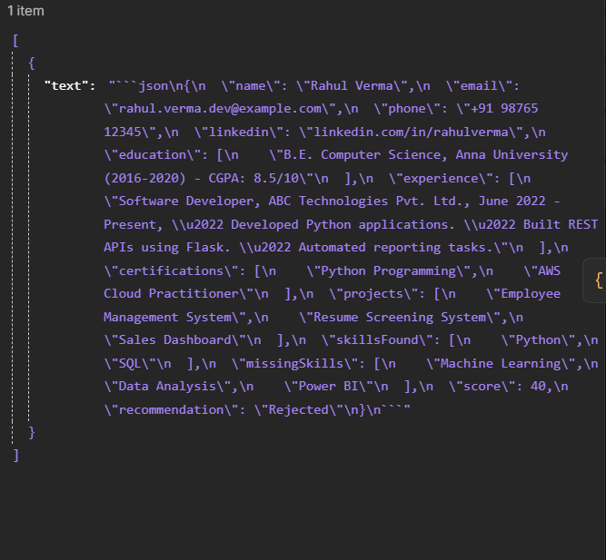
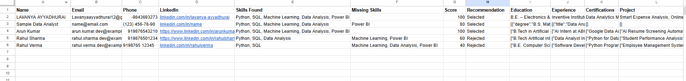
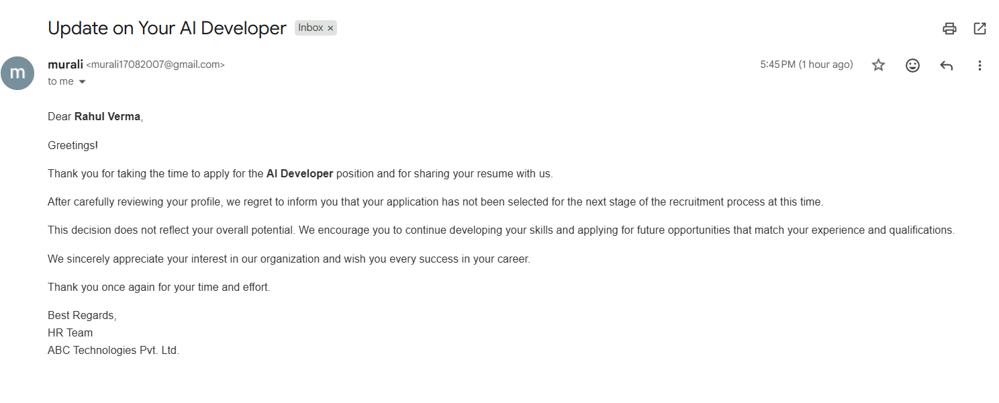
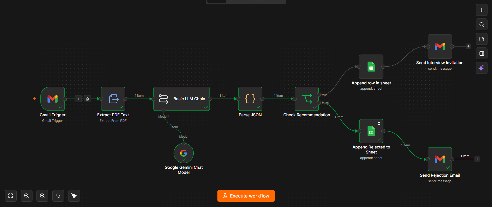

# AI Resume Screening Automation

An AI-powered recruitment automation system that automates the resume screening process using **n8n**, **OpenAI**, **Gmail**, **Google Drive**, and **Google Sheets**. The workflow extracts resume data, analyzes candidate skills using AI, scores applicants, stores the results, and sends automated email notifications.

## 🚀 Features

- Automatically collects resumes from Gmail or Google Drive
- Extracts text from PDF resumes
- Uses OpenAI to analyze candidate skills
- Scores candidates based on job requirements
- Stores candidate details in Google Sheets
- Sends automated selection or rejection emails
- Reduces manual recruitment effort

## 🛠️ Technologies Used

- n8n
- OpenAI API
- Gmail API
- Google Drive API
- Google Sheets API
- JavaScript

## 📋 Workflow

1. Receive resumes from Gmail or Google Drive.
2. Extract text from the uploaded PDF.
3. Analyze the resume using OpenAI.
4. Score the candidate based on skills and experience.
5. Save the results in Google Sheets.
6. Send an automated email to the candidate.

## ⚙️ How to Use

1. Import the `Resume_Screening_Workflow.json` file into n8n.
2. Connect your Gmail, Google Drive, and Google Sheets accounts.
3. Add your OpenAI API key.
4. Execute the workflow.
5. Upload or receive a resume to test the automation.

---

## 🤖 AI Analysis

---

## 📊 Google Sheets Output

---

## 📧 Email Notification

---

## ✅ Workflow Success

---

## 👨‍💻 Author

**Muralidharan V**

**B.Tech – Artificial Intelligence & Data Science**

GitHub: https://github.com/muralidharanv170807-spec
